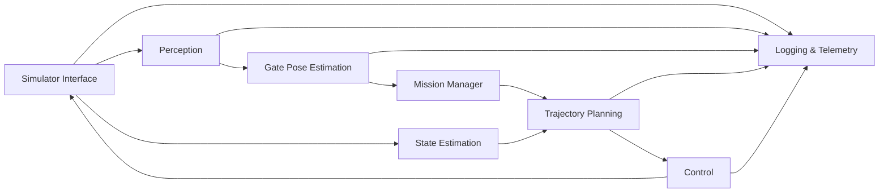

http://127.0.0.1:8080/ui/# Architecture

## Module Responsibilities

- Perception: outputs gate bounding boxes, corners, confidence, and track IDs.
- Pose estimation: computes relative 3D gate pose and confidence from corners using camera intrinsics.
- State estimation: fuses simulator truth and optional IMU updates behind a single interface.
- Planning: creates smooth approach/traverse/exit local trajectories respecting constraints.
- Control: maps trajectory targets to acceleration and yaw-rate commands.
- Mission manager: controls gate sequence and failure/retry behavior.
- Simulator interface: internal simulator now, adapters later for AirSim/Gazebo/PX4 SITL.
- Logging/telemetry: stores per-step traces and summary metrics for evaluation.

## Extensibility Hooks

- Perception backend abstraction supports swapping classical CV with learning detectors.
- State estimator API is ready for EKF/VIO replacement.
- Simulator wrapper now supports `internal` and `airsim` backends; can be extended to ROS 2 topics/services adapters.
- Controller interface can split high-level setpoints from PX4 offboard low-level commands.
